# elayeek-ai

This is where I back up random projects and tools I make for myself. It doubles as a Claude Code plugin marketplace to make it easier to sync back to my Claude.

| Plugin | Description |
|---|---|
| [`inline-review`](./inline-review) | Show a file or a git diff in a side pane and leave inline comments the model can read |
| [`deslop`](./deslop) | Find AI-authored slop in a change with read-only finder agents, grade each finding with a verifier, then fix the ones you pick |

## inline-review in action



## Install

```
/plugin marketplace add elayeek/elayeek-ai
/plugin install inline-review@elayeek-ai
/plugin install deslop@elayeek-ai
```

Outside a session, use `claude plugin marketplace add …` and `claude plugin install …`.

`inline-review` is a mod and needs Claude Code 2.1.287 or later.

## Update

Run `claude plugin update`. Auto-update is off by default for this marketplace.

To release, raise `version` in the plugin's `.claude-plugin/plugin.json`.

## Use in a team project

Add this to the project's `.claude/settings.json`:

```json
{
  "extraKnownMarketplaces": {
    "elayeek-ai": { "source": { "source": "github", "repo": "elayeek/elayeek-ai" } }
  },
  "enabledPlugins": { "inline-review@elayeek-ai": true }
}
```
